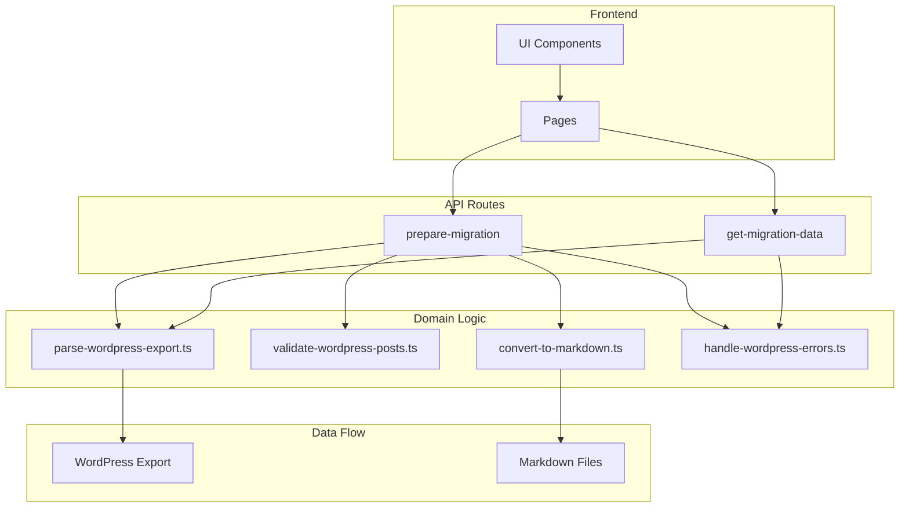

# Visual Migrator Architecture

## System Overview



## Component Details

### Frontend
- **UI Components**: React components for user interaction
- **Pages**: Next.js pages that compose UI components

### API Routes
- **prepare-migration**
  - Handles WordPress export file upload
  - Triggers migration process
  - Returns migration status

- **get-migration-data**
  - Retrieves current migration state
  - Returns parsed WordPress data

### Domain Logic
- **parse-wordpress-export.ts**
  - Parses WordPress XML export
  - Extracts posts and metadata
  - Handles XML parsing errors

- **validate-wordpress-posts.ts**
  - Validates post structure
  - Checks required fields
  - Ensures data integrity

- **convert-to-markdown.ts**
  - Converts WordPress HTML to Markdown
  - Handles image processing
  - Manages file organization

- **handle-wordpress-errors.ts**
  - Domain-specific error handling
  - Provides meaningful error messages
  - Manages error recovery

### Data Flow
1. WordPress export file is uploaded
2. File is parsed and validated
3. Content is converted to Markdown
4. Files are organized and saved
5. Status is reported back to UI

## File Structure

```
src/
├── app/
│   ├── api/
│   │   ├── prepare-migration/
│   │   │   ├── route.ts
│   │   │   ├── parse-wordpress-export.ts
│   │   │   ├── validate-wordpress-posts.ts
│   │   │   ├── convert-to-markdown.ts
│   │   │   ├── handle-wordpress-errors.ts
│   │   │   └── types.ts
│   │   └── get-migration-data/
│   │       ├── route.ts
│   │       ├── parse-wordpress-export.ts
│   │       ├── handle-wordpress-errors.ts
│   │       └── types.ts
│   └── page.tsx
├── components/
│   └── migration/
│       ├── MigrationForm.tsx
│       ├── MigrationStatus.tsx
│       └── types.ts
└── types/
    └── wordpress.ts
```

## Key Principles

1. **Domain-Driven Design**
   - Code organized around WordPress migration domain
   - Clear separation of concerns
   - Domain-specific error handling

2. **Functional Programming**
   - Pure functions for data transformation
   - Immutable data structures
   - Type-safe operations

3. **Error Handling**
   - Domain-specific error types
   - Graceful error recovery
   - User-friendly error messages

4. **Type Safety**
   - Strong TypeScript types
   - Domain-specific interfaces
   - Runtime type checking

5. **Testing**
   - Unit tests for domain logic
   - Integration tests for API routes
   - End-to-end tests for critical flows 
