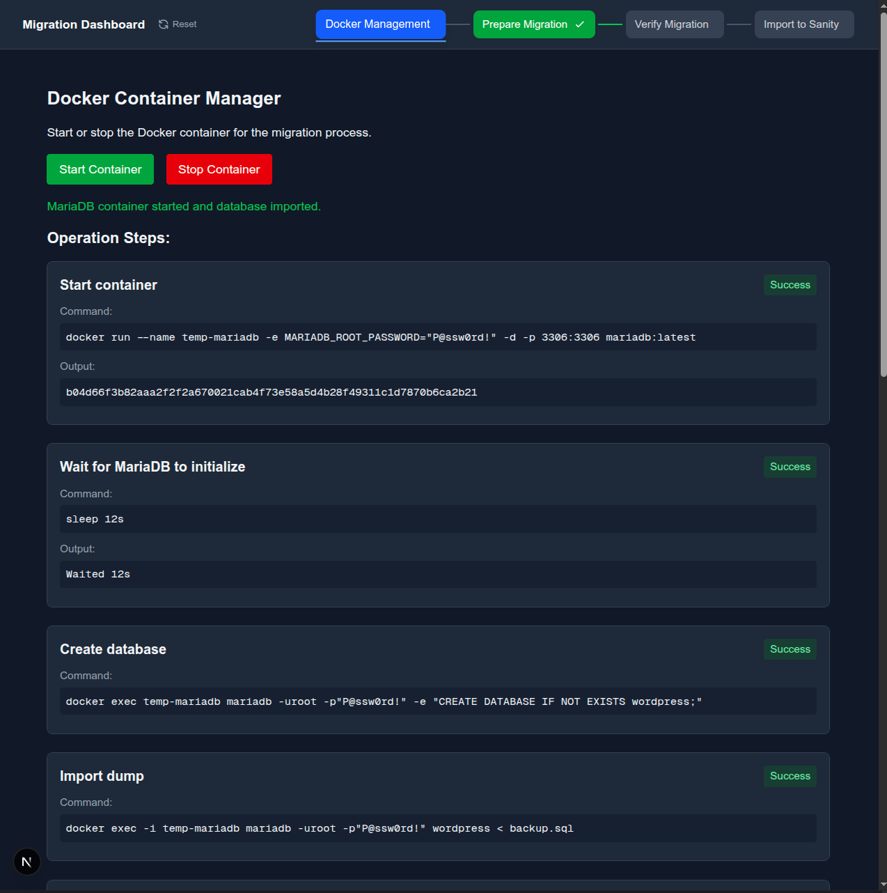
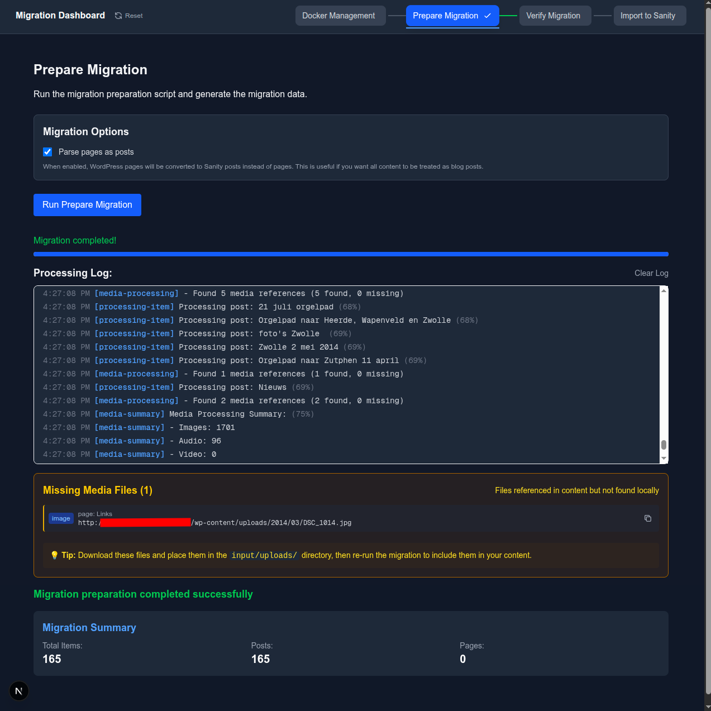
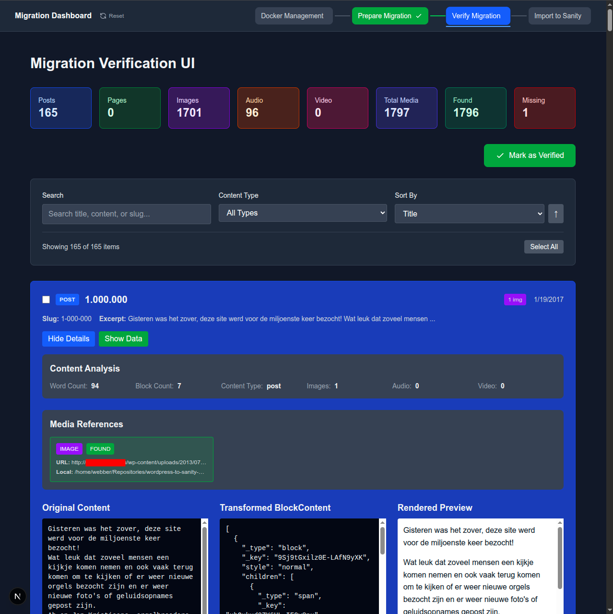
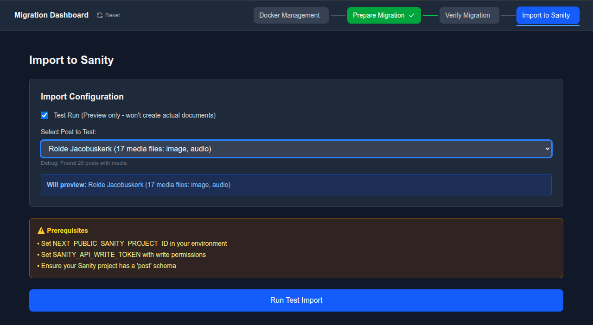
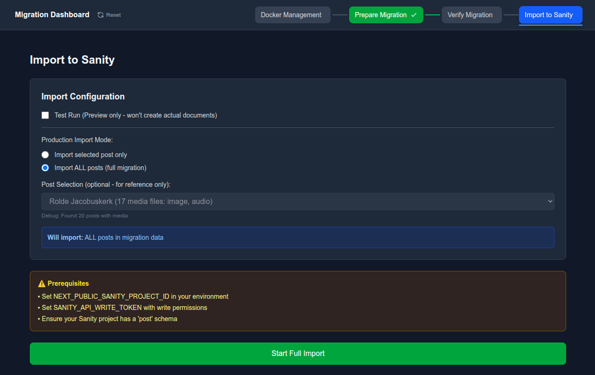

# 🚚 WordPress → Sanity Migrator

[](LICENSE)
[](https://github.com/webbertakken/wordpress-to-sanity-migrator/pulls)
[](https://github.com/webbertakken/wordpress-to-sanity-migrator/actions/workflows/main.yaml)
[](https://codecov.io/gh/webbertakken/wordpress-to-sanity-migrator)
[](https://prettier.io)
[](https://oxc.rs/docs/guide/usage/linter.html)

A visual, 4-step dashboard for migrating WordPress content into Sanity. From SQL dump to live import
— without the headaches.

---

## ✨ Features

- 🐳 **Docker Management** — spin up MariaDB and import your SQL dump in one click
- 🔄 **Prepare Migration** — extract posts, pages and media into Sanity-ready JSON
- 🔍 **Verify Migration** — search, filter and preview every transformed post
- 🚀 **Import to Sanity** — test run a single post, then ship the whole dataset

---

## 🛠️ Quick Start

```bash
yarn install
yarn dev
```

Drop your data into `/input`:

- `input/backup.sql` — WordPress database dump
- `input/uploads/` — media files (keep WordPress year/month structure)

Set Sanity credentials in `.env.local`:

```
NEXT_PUBLIC_SANITY_PROJECT_ID=...
NEXT_PUBLIC_SANITY_DATASET=...
SANITY_API_WRITE_TOKEN=...
SANITY_API_VERSION=...
```

---

## 📋 The 4 Steps

### 1️⃣ Spin up the database from your SQL dump



### 2️⃣ Prepare the migration



### 3️⃣ Verify every post before it ships



### 4️⃣ Test import a single post, then go for real

 

---

## 🧪 Development

```bash
yarn dev            # dev server (Turbopack)
yarn test           # run tests
yarn lint           # lint
yarn build          # production build
```

---

## 📄 License

MIT — see [LICENSE](LICENSE).
